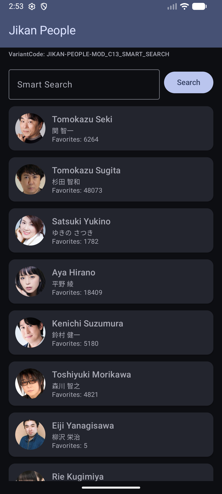
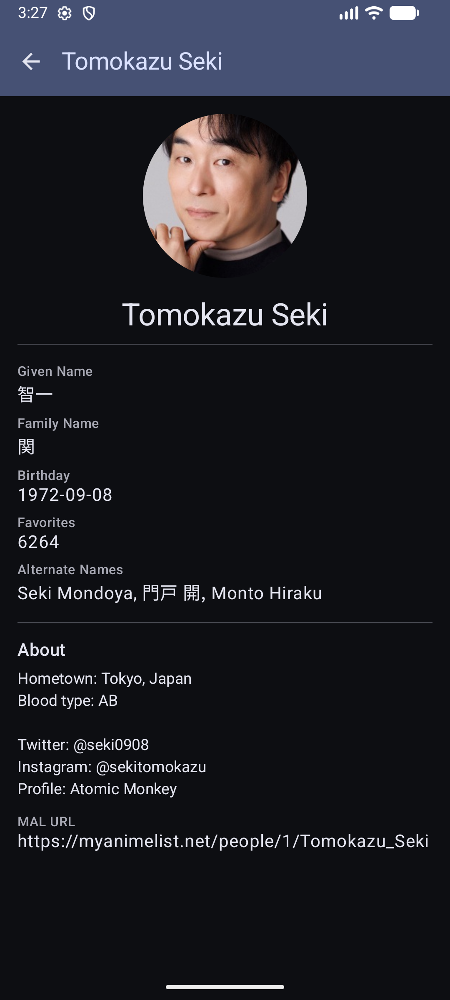

# Jikan People App
Выполнил: **Беседа Семен Денисович**

Вариант: **JIKAN-PEOPLE-MOD_C13_SMART_SEARCH**

## Endpoints

API Base URL: `https://api.jikan.moe/v4/`
- List: `GET /people?page=1&limit=25`
- Detail: `GET /people/{id}`
- Search: `GET /people?q=<query>`

## Стек и архитектура

- Kotlin + Jetpack Compose + Coroutines
- Сеть: Retrofit + OkHttp (logging) + Moshi
- DI: Hilt
- Навигация: Jetpack Navigation (Navigation-Compose)
- Изображения: Coil

### Слои

- **data**: DTO (`PersonDto`, `PeopleResponseDto`, `PaginationDto`), `JikanApi`, `PersonRepository`
- **domain**: UI-модель `Person`
- **ui**: экраны списка и деталей (`PeopleListScreen`, `PersonDetailScreen`), навигация (`AppNavigation`), кнопка retry

Экран списка показывает первую страницу людей, экран деталей открывается по клику и делает отдельный запрос по id

## Модификатор MOD_C13_SMART_SEARCH

- Перед отправкой запроса строка поиска нормализуется: `trim()`, `lowercase()`, замена множественных пробелов на один
- Поиск идёт по двум полям: API ищет по `name`, приложение дополнительно фильтрует результаты локально по `given_name` и `family_name`
- Реализация: `PersonRepository.searchPeople()` и `PersonRepository.normalizeQuery()`

## Скриншоты

 

